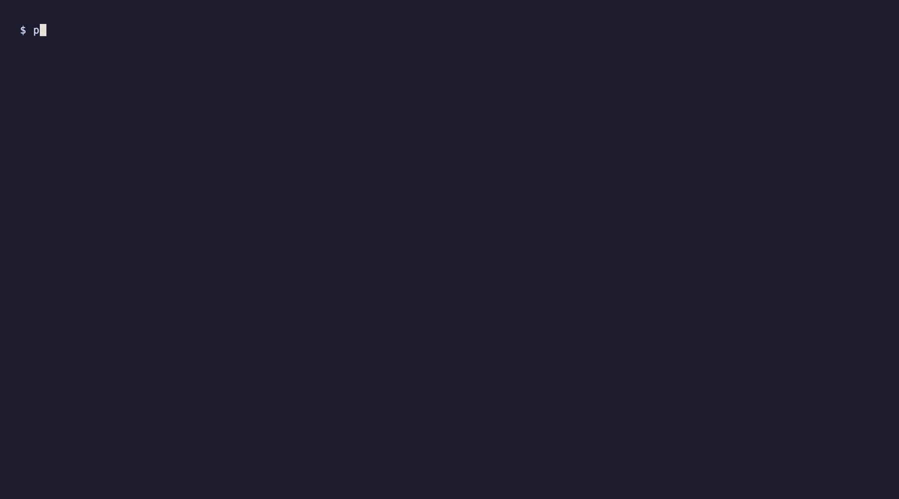

# Complete Workflow

Full RAG regression testing workflow from auto-capture to regression detection.

## Demo



## Overview

This demo demonstrates the complete LongProbe workflow in action. Perfect for:

- ✅ Understanding how LongProbe works end-to-end
- ✅ First-time users learning the tool
- ✅ Seeing all features in one comprehensive demo
- ✅ Understanding the regression detection process

## What It Shows

### 1. Test Questions

Shows the questions being tested upfront:

- Sample questions from your golden set
- Clear visibility into what's being validated
- Understanding the scope of testing

### 2. Workflow Progress (Animated)

A single, continuously updating progress panel showing:

- **Step 1**: Start Mock RAG API - Simulates your RAG backend
- **Step 2**: Build Golden Set - Auto-capture questions and expected chunks
- **Step 3**: Run Initial Check - Test retrieval quality (100% pass)
- **Step 4**: Save Baseline - Store results for future comparison
- **Step 5**: Break API - Simulate a regression (remove a document)
- **Step 6**: Detect Regression - Catch the issue automatically

### 3. Retrieval Example

Shows what the API returns:

- Actual question being tested
- Retrieved chunks with similarity scores
- Understanding how retrieval works

### 4. Regression Detection

Shows exactly what broke:

- Which question failed
- What chunk went missing
- Clear explanation of the regression

### 5. Results Table

Provides before/after comparison:

- Overall recall (100% → 86.7%)
- Pass rate (100% → 60%)
- Number of failed tests (0 → 2)

## Use Case

**Scenario**: You're building a RAG application and want to ensure changes don't break retrieval quality.

**Workflow**:

1. **Capture baseline** - Auto-generate golden questions from your RAG API
2. **Run tests** - Verify everything works (100% pass)
3. **Save baseline** - Store the perfect state
4. **Make changes** - Refactor, upgrade, or modify your RAG pipeline
5. **Detect regressions** - LongProbe catches issues automatically
6. **Fix and verify** - Address issues and re-run tests

## Code Example

The demo script shows the complete workflow:

```python
from longprobe import LongProbe
from longprobe.adapters import HttpAdapter
from longprobe.core.golden import GoldenSet, GoldenQuestion

# 1. Configure HTTP adapter for your RAG API
adapter = HttpAdapter(config=http_config)

# 2. Auto-capture golden questions
golden_questions = []
for question_text, tags in test_questions:
    results = adapter.retrieve(query=question_text, top_k=3)
    required_chunks = [r["text"] for r in results]
    golden_questions.append(GoldenQuestion(
        question=question_text,
        required_chunks=required_chunks,
        tags=tags
    ))

golden_set = GoldenSet(questions=golden_questions)
golden_set.to_yaml("goldens.yaml")

# 3. Run initial check
probe = LongProbe(adapter=adapter, goldens_path="goldens.yaml")
report = probe.run()
print(f"Recall: {report.overall_recall:.1%}")

# 4. Save baseline
probe.save_baseline(label="latest")

# 5. After making changes...
report_after = probe.run()

# 6. Detect regression
diff = probe.diff(baseline_label="latest")
if diff["regressions"]:
    print(f"⚠️  {len(diff['regressions'])} regressions detected!")
```

## Key Features Demonstrated

- 🎯 **Auto-capture** - Generate golden questions from your API
- 📊 **Live progress** - Single animated workflow panel
- 🔍 **Retrieval visibility** - See what chunks are retrieved
- 💾 **Baseline tracking** - Save and compare results
- 🚨 **Regression detection** - Catch issues automatically
- 📈 **Before/after comparison** - Clear metrics on what changed

## Workflow Steps Explained

### Step 1: Start Mock RAG API
Simulates your RAG backend with a simple HTTP server. In production, this would be your actual RAG API (LongTrainer, LangServe, etc.).

### Step 2: Build Golden Set
Auto-captures golden questions by querying your API and saving the retrieved chunks as expected results. This is the "capture" workflow.

### Step 3: Run Initial Check
Tests all questions against your RAG API and verifies 100% recall. This establishes your baseline.

### Step 4: Save Baseline
Stores the perfect state in SQLite for future comparison. You can have multiple baselines (v1.0, v2.0, etc.).

### Step 5: Break API
Simulates a regression by removing a document. In real scenarios, this could be:
- Refactoring chunking strategy
- Upgrading embedding model
- Changing retrieval parameters
- Accidentally deleting documents

### Step 6: Detect Regression
Re-runs tests and compares against baseline. LongProbe automatically detects:
- Which questions failed
- What chunks went missing
- Exact recall delta

## When to Use

Use this workflow when you need:

- Complete understanding of LongProbe
- End-to-end regression testing
- Baseline tracking and comparison
- Confidence before deployment

## CLI Equivalent

You can achieve similar results with CLI commands:

```bash
# Capture golden questions
longprobe capture --url http://localhost:8000/retrieve

# Run initial check
longprobe check --goldens goldens.yaml

# Save baseline
longprobe baseline save --label v1.0

# After changes, compare
longprobe diff --baseline v1.0
```

## Next Steps

- [Monitor RAG Quality](monitor-quality.md) - For detailed monitoring
- [Detect Regressions](detect-regressions.md) - For CI/CD integration
- [Python API Guide](../guide/python-api.md) - Learn more about the API
- [Baseline Management](../guide/baseline-management.md) - Advanced baseline workflows
