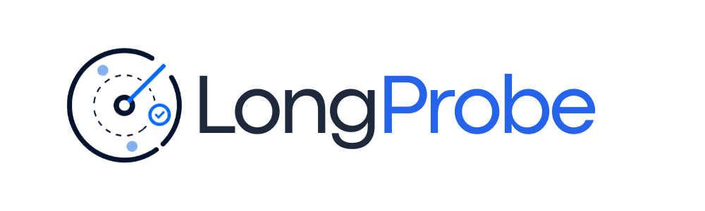

# LongProbe

<p align="center"></p>

<p align="center">
<strong>Sub-second RAG regression testing for production pipelines</strong>
</p>

<p align="center">
<a href="https://badge.fury.io/py/longprobe"></a>
<a href="https://pepy.tech/projects/longprobe"></a>
<a href="https://pypi.org/project/longprobe/"></a>
<a href="https://opensource.org/licenses/MIT"></a>
</p>

---

## Overview

> "Did my last commit break retrieval?" — now you know in seconds.

LongProbe is a **sub-second RAG regression harness**. Define your Golden Questions once, run `longprobe check` on every commit, and get an exact diff of which document chunks were lost in your latest change — before your users notice.

**Think `pytest --watch` for your RAG pipeline.**

## Why LongProbe?

Every RAG developer faces the same silent killer: you refactor chunking strategy, upgrade LangChain, or add a new document — and your retrieval silently degrades. DeepEval and RAGChecker are heavyweight evaluation frameworks meant for batch analysis, not fast regression checks in a dev loop.

**LongProbe gives you instant feedback:**

- ⚡ **Sub-second checks** on small golden sets
- 🔍 **Exact diffs** showing which chunks were lost/gained
- 📊 **Recall scores** with per-question breakdown
- 💾 **Baseline tracking** to catch regressions over time
- 🧪 **pytest integration** for existing test suites
- 🔌 **Pluggable adapters** for any vector store

## Quick Example

```bash
# Install
pip install longprobe

# Initialize
longprobe init

# Define your golden questions in goldens.yaml
# Configure your vector store in longprobe.yaml

# Run checks
longprobe check

# Save baseline
longprobe baseline save --label v1.0

# Compare after changes
longprobe diff --baseline v1.0
```

## Part of the Long Suite

LongProbe is part of the [EnDevSols Long Suite](https://endevsols.com/open-source) of RAG tools:

- **[LongParser](https://github.com/ENDEVSOLS/LongParser)** - Document ingestion and chunking
- **[LongTrainer](https://github.com/ENDEVSOLS/Long-Trainer)** - RAG chatbot framework
- **[LongTracer](https://github.com/ENDEVSOLS/LongTracer)** - Hallucination detection
- **[LongProbe](https://github.com/ENDEVSOLS/LongProbe)** - Retrieval regression testing ← You are here

Together they cover the full RAG pipeline from ingestion to production monitoring.

## Features

### Core Capabilities

- ⚡ **Sub-second checks** on small golden sets
- 📋 **Golden Questions + Required Chunks** defined in simple YAML
- 🔍 **Three match modes**: exact ID, text substring, semantic similarity
- 📊 **Recall Score** with per-question breakdown
- 🔄 **Regression diff**: exactly which chunks were lost/gained
- 💾 **SQLite baseline store**: compare against any previous run

### Developer Experience

- 🧪 **pytest plugin**: integrate into existing test suites
- 🖥️ **Beautiful CLI** with Rich tables, JSON, and GitHub Actions output
- 👀 **Watch mode**: auto re-run on file changes
- 🏗️ **CI/CD ready**: fails pipeline on regression

### Integrations

- 🔌 **Pluggable adapters**: LangChain, LlamaIndex, Chroma, Pinecone, Qdrant
- 🌐 **HTTP adapter**: test any RAG API
- 🐍 **Python API**: programmatic access to all features

## Next Steps

<div class="grid cards" markdown>

-   :material-clock-fast:{ .lg .middle } __Quick Start__

    ---

    Get up and running in 5 minutes

    [:octicons-arrow-right-24: Quick Start](getting-started/quick-start.md)

-   :material-book-open-variant:{ .lg .middle } __User Guide__

    ---

    Learn how to define golden questions and configure LongProbe

    [:octicons-arrow-right-24: User Guide](guide/golden-questions.md)

-   :material-video:{ .lg .middle } __Demos__

    ---

    See LongProbe in action with live demos

    [:octicons-arrow-right-24: View Demos](demos/overview.md)

-   :material-api:{ .lg .middle } __API Reference__

    ---

    Detailed API documentation for Python integration

    [:octicons-arrow-right-24: API Docs](api/core.md)

</div>

## Community & Support

- **GitHub Issues**: [Report bugs or request features](https://github.com/ENDEVSOLS/LongProbe/issues)
- **Discussions**: [Ask questions and share ideas](https://github.com/ENDEVSOLS/LongProbe/discussions)
- **Contributing**: [Contribution guidelines](contributing.md)

## License

LongProbe is released under the [MIT License](https://opensource.org/licenses/MIT).
